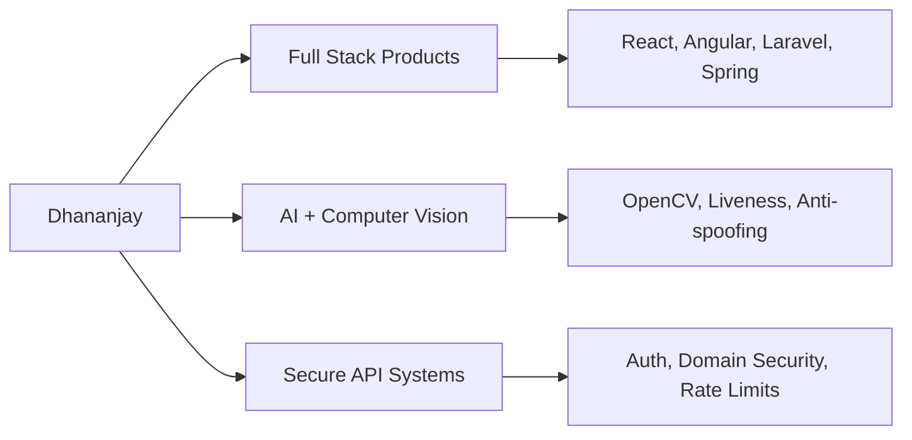

# 👋 Hey, I'm Dhananjay Salwe

### Full Stack Developer | AI/ML Builder | Cyber Security Focused

## 🌐 Connect

## 📝 Profile Summary
I build practical, high-impact products across web and AI.
My work combines strong backend engineering (Spring Boot, Laravel, Flask), modern frontend delivery (React, Angular), and security-first thinking.
I have shipped production projects including attendance platforms, embeddable face-recognition widgets, and resume-verification systems, with measurable outcomes like lower manual effort, faster APIs, and reliable real-time processing.

## 🧭 Snapshot

## 📊 Impact (Quick View)
| Metric | Value |
|---|---|
| Manual effort reduced | 70% |
| API latency improved | 40% |
| Resume verification accuracy | 85% |
| Real-time face recognition | 15-30 FPS |
| Lighthouse performance | 90+ |

## 🚀 Featured Work
| Project | What It Does | Stack |
|---|---|---|
| **Attendo** | Attendance system for 200+ users | Spring Boot, Angular, MySQL |
| **F-Widget** | Embeddable face-recognition SaaS widget | Laravel, Docker, Nginx, MySQL |
| **Swayamsiddh NGO** | Bilingual accessible NGO platform | Laravel, Bootstrap, MySQL |
| **Face Recognition Kiosk** | Liveness + anti-spoofing authentication | Flask, OpenCV, MediaPipe |
| **DataAuth** | Resume authenticity verification system | Laravel, RapidAPI, MySQL |

### 🔗 Project Showcase

## 🛠️ Core Stack
**Frontend**

**Backend & API**

**Data, AI & DevOps**

## 📈 GitHub Stats

## 🎓 Education & Certifications

---

**Open to:** freelance projects, remote roles, and impactful collaborations.
